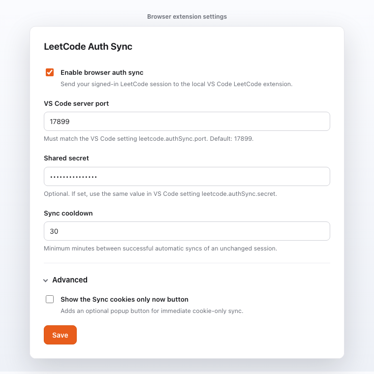
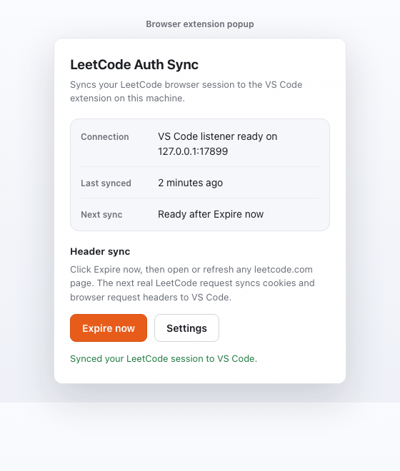
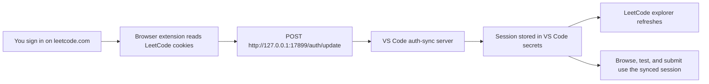

# LeetCode with Auth Sync

**VS Code extension:** [](https://marketplace.visualstudio.com/items?itemName=wilmtang.vscode-leetcode-auth-sync) [](https://marketplace.visualstudio.com/items?itemName=wilmtang.vscode-leetcode-auth-sync) [](https://marketplace.visualstudio.com/items?itemName=wilmtang.vscode-leetcode-auth-sync) [](https://github.com/wilmtang/vscode-leetcode/actions/workflows/build.yml) [](LICENSE)

**Browser extension:** [](https://addons.mozilla.org/en-US/firefox/addon/leetcode-vs-code-auth-sync/) [](https://chromewebstore.google.com/detail/leetcode-vs-code-auth-syn/elbnajbjhllgodibfhbfiigfmcfpbnck) [](https://open-vsx.org/extension/wilmtang/vscode-leetcode-auth-sync)

Solve LeetCode problems in VS Code with a companion browser extension that syncs your signed-in `leetcode.com` session to a local VS Code listener.

This is an unofficial fork maintained by `wilmtang` at [wilmtang/vscode-leetcode](https://github.com/wilmtang/vscode-leetcode). It is not affiliated with, endorsed by, sponsored by, or published by LeetCode. The original MIT license and copyright notices are preserved in [LICENSE](LICENSE), with fork attribution in [NOTICE.md](NOTICE.md).

## Visual Tour


<p align="center">
  
  
</p>



<p align="center">
  
  
</p>

## Why Use It

Older LeetCode VS Code workflows can break when LeetCode changes auth, CSRF, or bot-protection behavior. This fork keeps the workflow local and direct:

- **No manual cookie copying:** sign in to `leetcode.com` in your browser, then sync that browser session into VS Code.
- **More reliable test and submit:** VS Code reuses the synced cookie and captured browser request headers.
- **Local-first sync:** session data is posted only to the VS Code listener on `127.0.0.1`.
- **Useful failure messages:** auth-sync and Cloudflare failures surface as explicit sync/debug messages instead of generic login errors.

`leetcode.cn` support is currently broken and untested in this fork. Favorites and Solutions do not work on `.cn` after the move to direct API calls. Details live in [docs/maintainer-guide.md](docs/maintainer-guide.md#current-caveats).

## Quick Start

Install both pieces on the same machine:

1. Install [LeetCode with Auth Sync from the VS Code Marketplace](https://marketplace.visualstudio.com/items?itemName=wilmtang.vscode-leetcode-auth-sync) or [Open VSX](https://open-vsx.org/extension/wilmtang/vscode-leetcode-auth-sync).
2. Install the companion browser extension:
   - [Firefox Add-ons](https://addons.mozilla.org/en-US/firefox/addon/leetcode-vs-code-auth-sync/)
   - [Chrome Web Store](https://chromewebstore.google.com/detail/leetcode-vs-code-auth-syn/elbnajbjhllgodibfhbfiigfmcfpbnck)
3. Sign in to [leetcode.com](https://leetcode.com/) in that browser.
4. In VS Code, open the LeetCode side bar, click `Sign In`, and choose `Auto Cookie Sync`.
5. In the browser extension popup, click `Expire now`, then open or refresh any `leetcode.com` page.

When sync succeeds, the VS Code notification closes, the LeetCode side bar refreshes, and test/submit commands use the same LeetCode session as your browser.

If a browser store listing is not available for your browser, load `browser-extension/` manually from a local checkout. See [Local Development](#local-development).

## Main Features

- Browse, search, preview, and open LeetCode problems from the VS Code side bar.
- Generate local solution files under the configured workspace folder.
- Run tests and submit solutions from editor CodeLens shortcuts.
- Star and unstar problems on the validated `leetcode.com` endpoint.
- Click the `LeetCode: <username>` status bar item to open a personal stats panel with solved counts, ranking, language stats, and recent accepted submissions.
- Sync auth from Chrome, Chromium, or Firefox through the companion browser extension.

Core commands:

- `LeetCode: Sign In`
- `LeetCode: Sign Out`
- `LeetCode: Show User Profile`
- `LeetCode: Search Problem`
- `LeetCode: Pick One`
- `LeetCode: Show Browser Auth Sync Status`
- `LeetCode: Restart Browser Auth Sync Server`

Browser extension controls:

- `Expire now`: bypasses the cooldown for the next real LeetCode request.
- `Cookie-only sync`: optional advanced button that sends cookies immediately, without browser request headers.
- `Enabled`: turns browser-side sync on or off.
- `Port`: must match `leetcode.authSync.port` in VS Code. Default: `17899`.
- `Shared secret`: optional. If set in VS Code, set the same value in the browser extension.
- `Cooldown`: controls how often automatic browser sync can run after a successful unchanged-session sync.

## How Auth Sync Works

The browser extension does not log in to LeetCode by itself. It copies the already-signed-in browser session into VS Code over a loopback-only HTTP endpoint.



Important details:

- The VS Code extension listens on `127.0.0.1` only. Default endpoint: `POST http://127.0.0.1:17899/auth/update`.
- The health endpoint is `GET http://127.0.0.1:17899/health`.
- If several VS Code windows are open, only one owns the listener. Other windows verify the live owner through `/health` and can take over when that listener is gone.
- Automatic sync observes LeetCode XHR/fetch requests and respects the configured cooldown after a successful unchanged-session sync.
- `Expire now` bypasses the cooldown for the next real LeetCode request.
- Cookie values are sent only to the local VS Code listener and are not intentionally logged.
- If `leetcode.authSync.secret` is set, the browser extension must send the same value in the `X-LeetCode-AuthSync-Secret` header.

### Security Note

`leetcode.authSync.secret` is empty by default for zero-config local sync. With no secret set, the listener accepts a request that reaches `127.0.0.1:<port>` and carries a valid LeetCode session cookie, as long as it is not identified as a cross-site browser request.

That blocks ordinary malicious websites through the Origin/CORS checks, but it is not a boundary against another local process on the same machine. If you do not trust local processes or other local users, set `leetcode.authSync.secret` in VS Code and enter the same value in the browser extension settings.

## Settings

| Setting | Default | Description |
| --- | --- | --- |
| `leetcode.hideSolved` | `false` | Hide solved problems. |
| `leetcode.defaultLanguage` | `N/A` | Default solution language. |
| `leetcode.useWsl` | `false` | Use WSL. |
| `leetcode.endpoint` | `leetcode` | Active endpoint. `leetcode-cn` is currently broken in this fork. |
| `leetcode.workspaceFolder` | `""` | Folder for generated problem files. |
| `leetcode.filePath` | `""` | Relative folder and filename pattern for problem files. |
| `leetcode.enableStatusBar` | `true` | Show the LeetCode status bar item. |
| `leetcode.editor.shortcuts` | `["submit, test"]` | Editor CodeLens shortcuts. |
| `leetcode.enableSideMode` | `true` | Open preview, solution, and submission tabs in the second editor column. |
| `leetcode.showCommentDescription` | `false` | Include problem descriptions in generated files. |
| `leetcode.useEndpointTranslation` | `true` | Use endpoint translations when available. |
| `leetcode.colorizeProblems` | `true` | Add difficulty badges and colors to problem files in the explorer. |
| `leetcode.problems.sortStrategy` | `None` | Problem list sorting strategy. |
| `leetcode.allowReportData` | `false` | Opt in to anonymous upstream telemetry. |
| `leetcode.authSync.enabled` | `true` | Enable the local browser auth-sync server. |
| `leetcode.authSync.port` | `17899` | Local port used by the browser auth-sync server. |
| `leetcode.authSync.ownerHeartbeatIntervalSeconds` | `30` | Owner heartbeat interval. |
| `leetcode.authSync.observerCheckIntervalSeconds` | `60` | Observer health-check interval. |
| `leetcode.authSync.secret` | `""` | Optional shared secret required on browser auth-sync requests when set. |

## Local Development

Install dependencies:

```bash
npm ci --replace-registry-host=always
```

Common commands:

```bash
npm run compile
npm test
npm run local -- vscode:dev
npm run local -- vscode:install
npm run local -- chrome:dev
npm run local -- chrome:dev-current
npm run auth-sync:lint:firefox
npm run auth-sync:build:firefox
npm run auth-sync:build:chrome
```

Manual browser-extension loading:

- Chrome: open `chrome://extensions`, enable Developer mode, click `Load unpacked`, and select `browser-extension/`.
- Firefox: open `about:debugging#/runtime/this-firefox`, click `Load Temporary Add-on`, and select `browser-extension/manifest.json`.

End-to-end local smoke test:

1. Start VS Code locally with `npm run local -- vscode:dev`.
2. Start the browser extension with `npm run local -- chrome:dev`, or load it manually.
3. Sign in to `https://leetcode.com` in that browser profile.
4. In VS Code, choose `LeetCode: Sign In`, then `Auto Cookie Sync`.
5. In the browser extension popup, click `Expire now`, then open or refresh any `leetcode.com` page.
6. Confirm the VS Code waiting notification closes and the LeetCode explorer refreshes as signed in.
7. Run a problem test or submit command to confirm the synced cookie works.

For the full local workflow, current caveats, audit notes, and release process, see [docs/maintainer-guide.md](docs/maintainer-guide.md).

## Requirements

- [VS Code 1.57.0+](https://code.visualstudio.com/)

No Node.js runtime is required for extension users. The extension talks to LeetCode directly over HTTP/GraphQL using your synced browser cookie. On the rare occasion LeetCode serves a Cloudflare challenge, the extension falls back to the system `curl`, which ships with macOS, Windows 10+, and most Linux distributions.

## Help

Check the [Troubleshooting](https://github.com/wilmtang/vscode-leetcode/wiki/Troubleshooting) and [FAQ](https://github.com/wilmtang/vscode-leetcode/wiki/FAQ) pages first. If the issue is still unresolved, [file an issue](https://github.com/wilmtang/vscode-leetcode/issues/new/choose).

## Release Notes

See [CHANGELOG.md](CHANGELOG.md).

## Acknowledgement

This extension originated from [@jdneo](https://github.com/jdneo)'s [vscode-leetcode](https://github.com/LeetCode-OpenSource/vscode-leetcode), which built on [@skygragon](https://github.com/skygragon)'s [leetcode-cli](https://github.com/skygragon/leetcode-cli). This fork no longer bundles `leetcode-cli`; it talks to LeetCode directly using a synced browser cookie.

Special thanks to the project [contributors](ACKNOWLEDGEMENTS.md).
